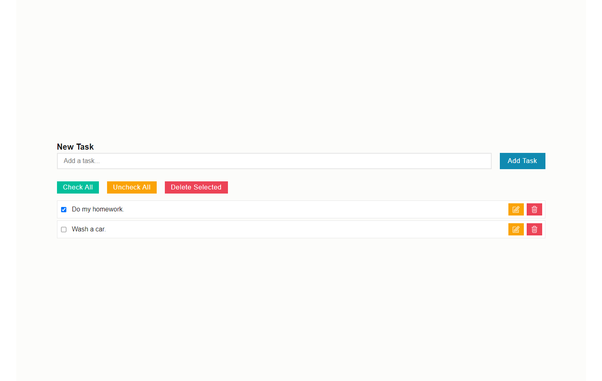
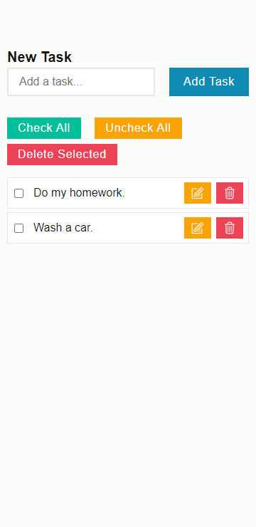

# Frontend Mentor - Manage landing page solution
## Table of contents

- [Overview](#overview)
  - [The challenge](#the-challenge)
  - [Screenshot](#screenshot)
  - [Links](#links)
- [My process](#my-process)
  - [Built with](#built-with)
  - [What I learned](#what-i-learned)
  - [Useful resources](#useful-resources)
- [Author](#author)


## Overview

### The challenge

Users should be able to:

- View the optimal layout for the site depending on their device's screen size
- See hover states for all interactive elements on the page
- See all testimonials in a horizontal slider
- Receive an error message when the newsletter sign up `form` is submitted if:
  - The `input` field is empty
  - The email address is not formatted correctly

### Screenshot




 
### Links

- Solution URL: (https://github.com/AlgirdasU/Manage-langin-page-master)
- Live Site URL: (https://shiny-blini-eb24dc.netlify.app)

## My process

### Built with

- Semantic HTML5 markup
- CSS custom properties
- SCSS
- Flexbox
- CSS Grid
- BEM
- JS

### What I learned

I learned to think before I start working :) How to validate email using JS and simplify this code and how to create a horizontal Scrolling slides.

Email validation.

```html
 <form action="url" class="footer__form">
     <input
       type="email"
       name="email"
       placeholder="Updates in your inbox… "
       class="footer__email"
       required
       />
  <span class="footer__invalid-email-message"></span>
  </form>
```
```css

```
```js
const email = document.querySelector(".footer__email");
const errorMsg = document.querySelector(".footer__invalid-email-message");

email.addEventListener("input", () => {
  email.value &&
  /^\w+([\.-]?\w+)*@\w+([\.-]?\w+)*(\.\w{2,3})+$/.test(email.value)
    ? (errorMsg.textContent = "")
    : (errorMsg.textContent = "Please insert a valid email");
});
```

### Useful resources

- (https://codepen.io/Maniraj_Murugan/pen/WNvxQPq) - Email validation code.
- (https://swiperjs.com/) - Swiper is the most modern free mobile touch slider with hardware accelerated transitions and amazing native behavior.

## Author

- Website - [Algirdas](https://github.com/AlgirdasU/Manage-langin-page-master)
- Frontend Mentor - [@Algirdase](https://www.frontendmentor.io/profile/AlgirdasU)
- Twitter - [@AlgirdasDdd](https://twitter.com/algirdasddd)


